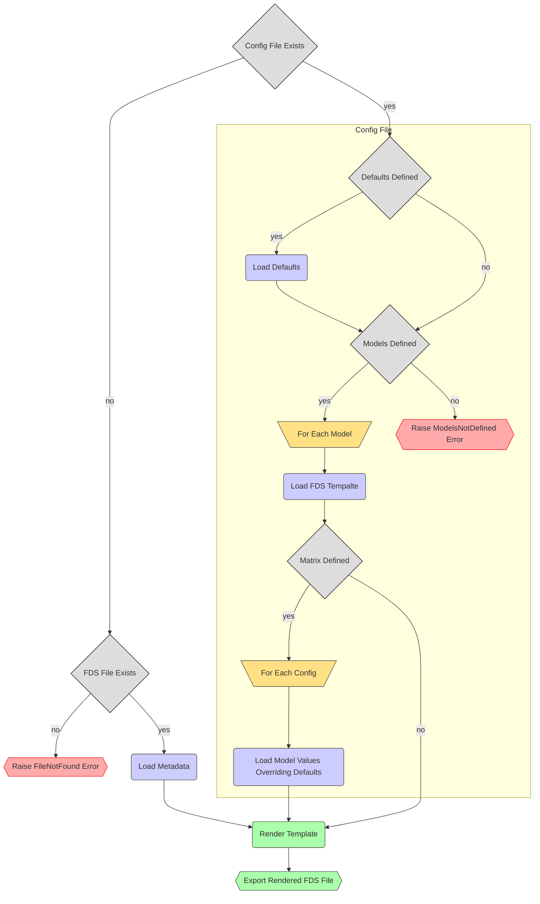

# Render Command

```console title="Usage"
xfds render [fds_file or config_file]
```

The xFDS render command will take either an FDS file


```mermaid
flowchart TB

    classDef decision fill:#ddd,stroke:#000
    classDef error fill:#ffaaaa,stroke:#f00
    classDef success fill:#aaffaa,stroke:#424242
    classDef load fill:#ccccff,stroke:#424242
    classDef iterate fill:#FFE085,stroke:#424242

    config_exists{Config File Exists}:::decision
    fds_exists{FDS File Exists}:::decision
    defaults{Defaults Defined}:::decision
    models{Models Defined}:::decision
    matrix{Matrix Defined}:::decision

    load_meta(Load Metadata):::load
    load_defaults(Load Defaults):::load
    load_values(Load Model Values Overriding Defaults):::load
    load_template(Load FDS Tempalte):::load
    render(Render Template):::success

    model_loop[\For Each Model/]:::iterate
    permute[\For Each Config/]:::iterate

    file_not_found{{Raise FileNotFound Error}}:::error
    models_not_defined{{Raise ModelsNotDefined Error}}:::error
    export{{Export Rendered FDS File}}:::success

    subgraph config_file[Config File]
        defaults -->|yes| load_defaults --> models -->|yes| model_loop --> load_template --> matrix -->|yes| permute --> load_values
        defaults -->|no| models
        models -->|no| models_not_defined
    end

    fds_exists -->|no| file_not_found
    config_exists -->|no| fds_exists -->|yes| load_meta --> render

    config_exists -->|yes| defaults
    matrix -->|no| render
    load_values --> render

    render --> export
```
